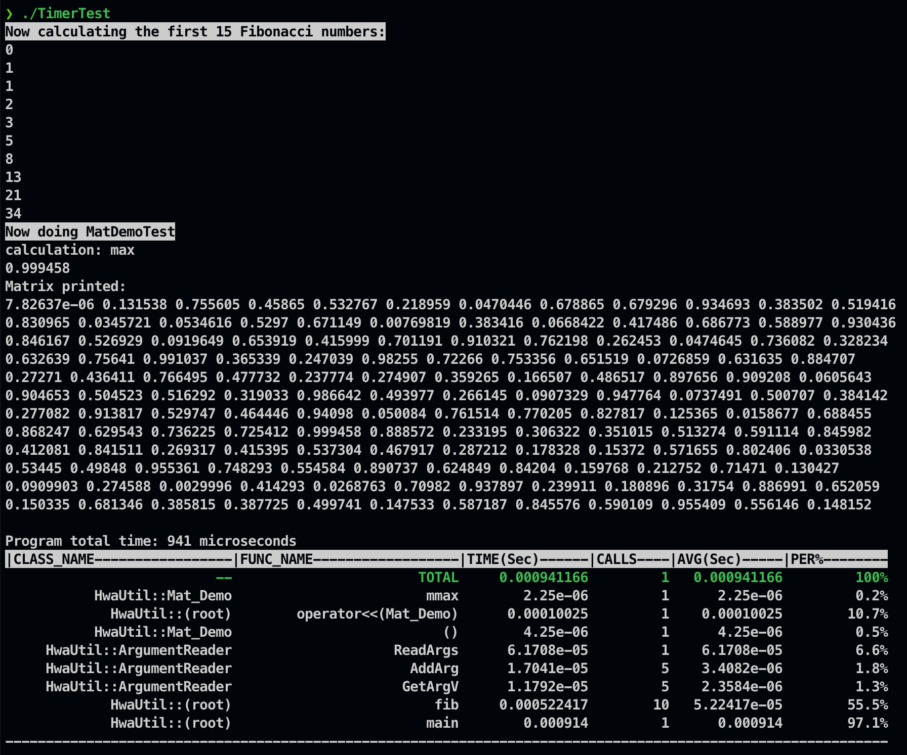

#  第六次作业: 写计时类

2100011046 杨家骅

## 项目结构

项目目录分为类库和测试程序两部分，采用CMake进行多文件编译的组织。

- 计时类`Timer`的代码在目录TimerClass/src中，分为"Timer.h"和"Timer.cpp"两个文件生成一个静态库。该类定义在名称空间`HwaUtil`中。
- 对该类的测试程序`TimerTest`的代码在目录TimerClass/test中，生成一个可执行文件。
- 测试利用了上次作业的代码, 程序引用了之前编写好的`ArgumentReader`类和`Mat_Demo`两个类,代码在目录TimerClass/src中，各自生成一个类库。这两个类都定义在名称空间`HwaUtil`中,并已经经过修改,嵌入了对计时类`Timer`的调用。
- input.txt文件分别用于测试时给定输入内容，与`Mat_Demo`类测试时相同,编译时会同步拷贝到输出目录。


## `Timer` 类使用说明
为实现计时功能，只需在每段需要计时的函数开始处和所有可能返回的语句前分别调用`Timer::start()`和`Timer::stop()`即可。计时结果会自动记录到全局存在的`Timer::time`中。
程序结束时调用print_time_usage，输出程序运行的总时间,并以表格的形式列出各函数用时情况。

## `Timer` 类的实现方法概述
通过一静态哈希表`func_time_info`将函数名映射到每个函数对应的FuncTimeInfo实例，FuncTimeInfo类记录一个函数每次调用的开始时间和结束时间，存储在TimerRecord结构的vector中。计时采用C++标准库中的`std::chrono::high_resolution_clock`类，该类提供了`now()`函数，返回一个`std::chrono::time_point`对象表示当前的时间。两个`std::chrono::time_point`对象之差为`std::chrono::duration`对象，表示经历的时间间隔。

`Timer`类还支持递归调用的情况, 利用一个`n_recursion`变量跟踪记录当前还未返回的函数实例数, 仅在最外层的递归返回时认为一次调用结束, 最终得到的调用次数也是互不包含的调用"群组"数量。

## `TimerTest` 测试程序
`main`函数中,首先进行了Fibbonacci数列前15项的计算,以测试计时类对递归程序的支持;进而执行了矩阵类和输入类的程序,并在运行全程进行统计.

## 编译
要求C++20支持.
```bash
mkdir cmake-build
cd cmake-build
cmake ..
cmake --build .
```
## 运行
```bash
cd ./bin/TimerTest
./TimerTest
```
输出如下：
